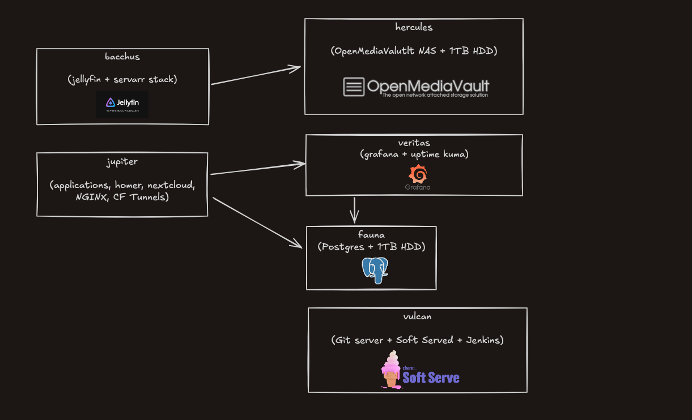

# My Home Lab

## Ansible

All my servers are bootstrapped using Ansible.

### Concepts

- Control node: Machine from which ansible commands are run
- Managed nodes: Hosts that you want to manage with Ansible
- Inventory: Defines your network topology
- Playbook: Basic unit of Ansible execution

